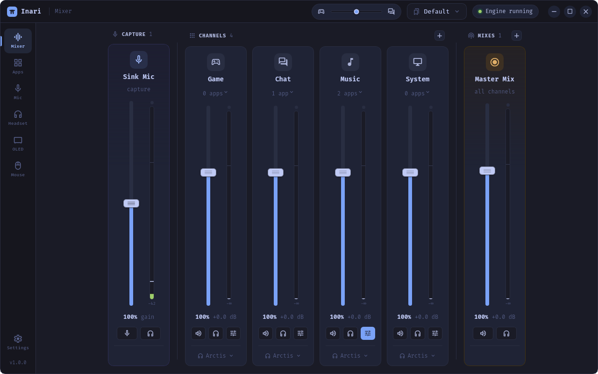
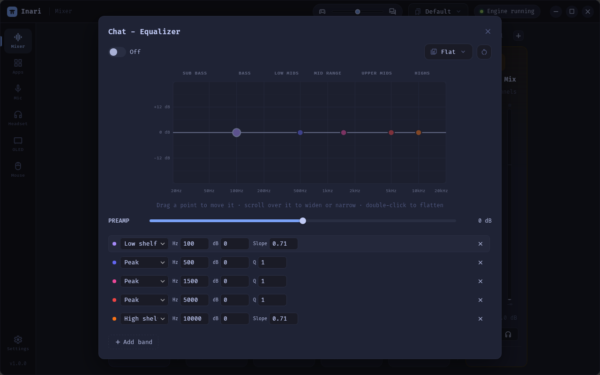
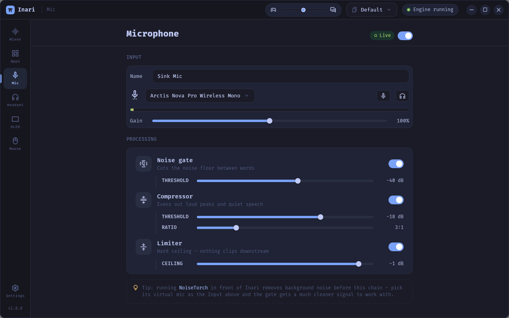
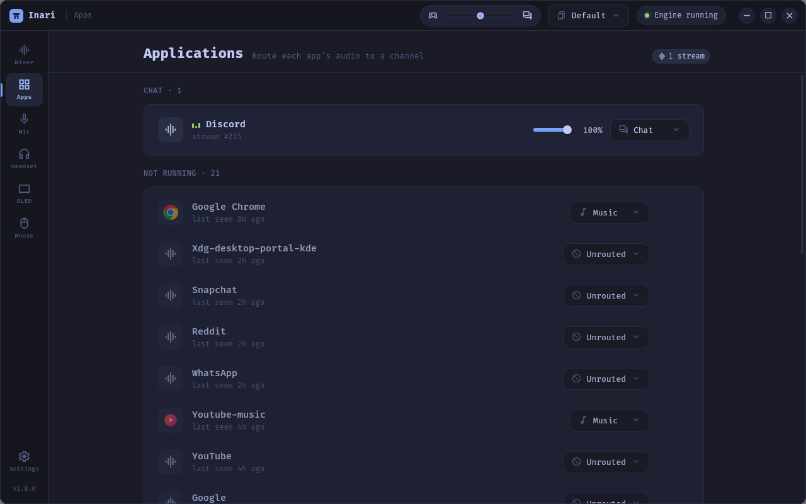
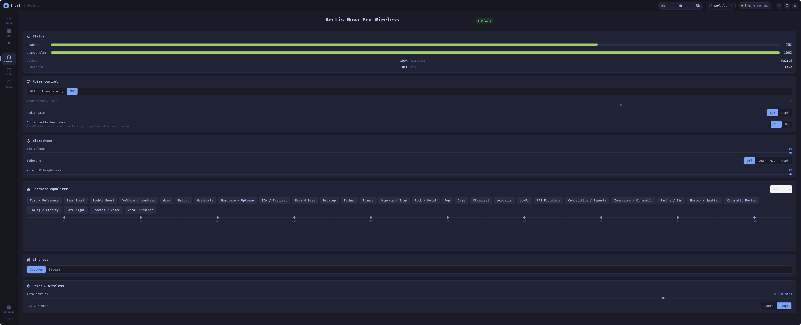
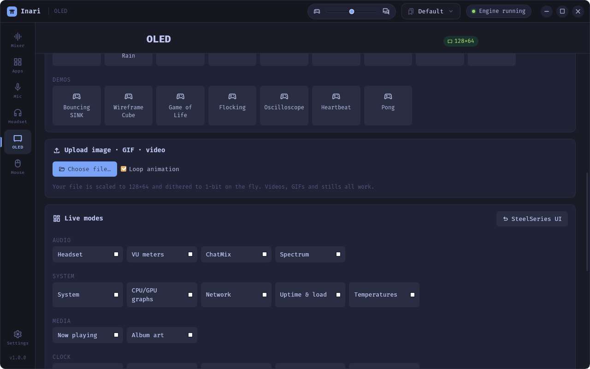
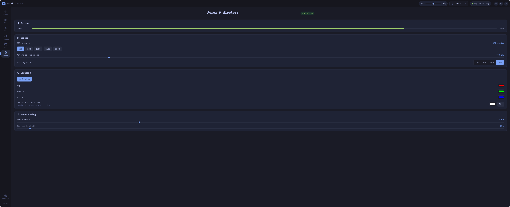

# Inari

[](https://github.com/fbnlrz/inari)
[](https://ko-fi.com/fbnlrz)
[](https://www.buymeacoffee.com/fbnlrz)

> **This is a fork of [NC1107/sink](https://github.com/NC1107/sink)** that adds
> control for SteelSeries headsets, the base-station OLED, and the Aerox mouse,
> plus a Tokyo Night theme. All the original Sink audio-mixing work is by
> [@NC1107](https://github.com/NC1107) — please support the upstream project
> (see [Credits](#credits)). Hardware support here is Linux-only and specific to
> the author's devices; upstream deliberately keeps it out of the main app.

**Inari** — SteelSeries Sonar for Linux. Built on PipeWire.

Route each app to its own channel - Game, Chat, Music - and control
volume, mute, and output device per channel. Build mixes for OBS and a
processed virtual microphone for voice chat.



```
 apps ─► channels ─► your ears
              └────► a Mix ─► OBS / recorder
```

## Features

- **Channels** - per-app routing with volume, mute, meters, and a choice
  of output device per channel
- **Apps** - running apps appear automatically; assign once, remembered
  forever
- **Mixes** - recordable sources for OBS. Master Mix carries everything;
  custom mixes can carry "everything except music" and stay current as
  channels change. In OBS, add a mix as an audio input - not Desktop Audio.
- **Equalizer** - per-channel parametric EQ (up to 10 bands) with a
  draggable response curve, bundled community presets, and import/export
  including AutoEq text blocks
- **Microphone** - noise gate, compressor and limiter into a virtual mic
  you select in Discord or OBS. Pairs well with
  [NoiseTorch](https://github.com/noisetorch/NoiseTorch) on the input for
  noise suppression before the chain.
- **Profiles** - save and switch full layouts from the tray
- **Headset** - full control of a **SteelSeries Arctis Nova Pro Wireless**
  base station over USB (no root, no SteelSeries GG): live battery, ANC /
  transparency, sidetone, mic volume & mute-LED, 10-band hardware EQ, auto-off,
  wireless speed/range, line-out, and a ChatMix read-out. See
  [docs/headset.md](docs/headset.md).
- **OLED** - drive the base station's 128×64 display: live dashboard,
  system monitor (CPU/RAM/GPU), now playing, desktop-notification mirroring,
  text, built-in animations, and your own images / GIFs / videos, scaled and
  dithered on the fly.
- **Mouse** - SteelSeries **Aerox 9 Wireless**: DPI presets, polling rate,
  per-zone RGB, reactive lighting, sleep and dim timeouts, battery.
- **Themes** - ships the original look plus a **Tokyo Night** palette,
  switchable in Settings.

## Screenshots

<table>
  <tr>
    <td width="50%"><br><sub><b>Equalizer</b> — per-channel parametric EQ with a draggable curve</sub></td>
    <td width="50%"><br><sub><b>Microphone</b> — gate, compressor and limiter into a virtual mic</sub></td>
  </tr>
  <tr>
    <td width="50%"><br><sub><b>Apps</b> — running apps, assigned once and remembered</sub></td>
    <td width="50%"><br><sub><b>Headset</b> — Arctis Nova Pro Wireless control over USB</sub></td>
  </tr>
  <tr>
    <td width="50%"><br><sub><b>OLED</b> — drive the base station's 128×64 display</sub></td>
    <td width="50%"><br><sub><b>Mouse</b> — Aerox 9 Wireless: DPI, polling, RGB, battery</sub></td>
  </tr>
</table>

## Install

**Quick start (Debian / Ubuntu)** — install or update to the latest release in one line:

```bash
curl -fsSL https://raw.githubusercontent.com/fbnlrz/Inari/main/get-inari.sh | bash
```

Or with wget:

```bash
wget -qO- https://raw.githubusercontent.com/fbnlrz/Inari/main/get-inari.sh | bash
```

This grabs the latest `.deb` from the [releases](https://github.com/fbnlrz/inari/releases)
and installs it with apt (pulling in any runtime dependencies). Re-run it any
time to update. Prefer to read it first? See [get-inari.sh](get-inari.sh).
Uninstall with `curl -fsSL https://raw.githubusercontent.com/fbnlrz/Inari/main/get-inari.sh | bash -s -- --uninstall`.

**Build and install from source (any distro)**

```bash
git clone https://github.com/fbnlrz/inari && cd inari
./install.sh
```

`install.sh` installs the build/runtime dependencies for Debian/Ubuntu (and
derivatives like Mint, Pop!_OS), Fedora and Arch, builds the release binary,
and installs the app, its desktop entry and the udev rule that lets Inari talk
to SteelSeries devices without root. Useful flags: `--deps-only`, `--no-deps`,
`--uninstall` (uninstall keeps your `~/.config/inari`).

**Debian / Ubuntu — manual dependencies**

If you would rather do it by hand:

```bash
sudo apt update
sudo apt install -y build-essential curl wget file pkg-config \
  libwebkit2gtk-4.1-dev libayatana-appindicator3-dev librsvg2-dev \
  libssl-dev libxdo-dev libpipewire-0.3-dev clang ffmpeg
curl --proto '=https' --tlsv1.2 -sSf https://sh.rustup.rs | sh   # if you have no Rust
npm install && ./node_modules/.bin/tauri build --no-bundle
sudo install -Dm755 target/release/sink /usr/bin/inari
```

`ffmpeg` is optional and only needed to play videos on the headset OLED.

### Prebuilt packages

Every release ships prebuilt Linux bundles on the
[Releases page](https://github.com/fbnlrz/inari/releases). Grab the one for your
distro and install it directly:

**Debian / Ubuntu / Mint**

```bash
sudo apt install ./Inari_*_amd64.deb
```

**Fedora / openSUSE**

```bash
sudo dnf install ./Inari-*.x86_64.rpm
```

These install the app properly - launcher entry, icon, uninstall through your
package manager.

**Any other distro - AppImage (portable, no root)**

```bash
chmod +x Inari_*_amd64.AppImage
./Inari_*_amd64.AppImage
```

To get a launcher entry for an AppImage, use
[Gear Lever](https://flathub.org/apps/it.mijorus.gearlever) or
AppImageLauncher.

Requires PipeWire with `pipewire-pulse` and WirePlumber 0.5+ (the default
on most current distros).

## Build

```bash
npm install
npm run tauri dev      # run
npm run tauri build    # package
```

Config lives in `~/.config/inari` as plain JSON. Upgrading from the upstream
Sink? Run `./migrate-to-inari.sh` once to move your existing `~/.config/sink`
over (see the script for details).

## Credits

This is a fork. The original **Sink** — all the PipeWire audio mixing, the
channels/mixes/EQ/mic work, and the app itself — is by
**[@NC1107](https://github.com/NC1107)**:
[NC1107/sink](https://github.com/NC1107/sink). If you find Sink useful, please
support the upstream project.

The SteelSeries hardware protocols used by this fork were learned from these
projects, whose reverse-engineering made the headset, OLED and mouse support
possible:

- [Sapd/HeadsetControl](https://github.com/Sapd/HeadsetControl)
- [elegos/Linux-Arctis-Manager](https://github.com/elegos/Linux-Arctis-Manager)
- [loteran/Arctis-Sound-Manager](https://github.com/loteran/Arctis-Sound-Manager)

Not affiliated with or endorsed by SteelSeries.

### Support this fork

If the SteelSeries additions are useful to you:

[](https://ko-fi.com/fbnlrz)
[](https://www.buymeacoffee.com/fbnlrz)
[](https://github.com/sponsors/fbnlrz)

## License

[GPL-3.0](LICENSE)
